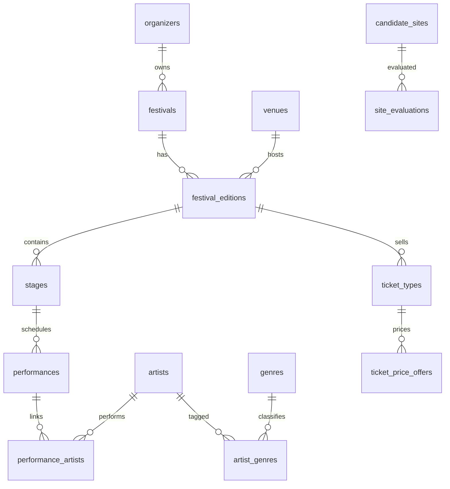

# Benelux 电子音乐节数据库与 GIS 选址分析报告

## 1. 项目概述

本项目面向 Benelux 地区大型电子音乐节，构建一个同时支持业务数据管理和空间选址分析的 PostgreSQL/PostGIS 数据库。项目选择三个具有代表性的电子音乐节作为分析对象：

| 音乐节 | 届次 | 国家 | 场地 |
| --- | ---: | --- | --- |
| Tomorrowland | 2025 | Belgium | De Schorre, Boom |
| Defqon.1 | 2025 | Netherlands | Walibi Holland event grounds, Biddinghuizen |
| Awakenings Summer Festival | 2025 | Netherlands | Beekse Bergen, Hilvarenbeek |

项目目标包括：

1. 建立规范化的音乐节业务数据库，覆盖主办方、音乐节、场地、届次、舞台、艺人、演出、票种和票价等实体。
2. 建立空间分析数据模型，覆盖候选场地、交通枢纽、人口网格、生态保护区和噪声敏感设施。
3. 使用 PostGIS 完成候选场地多指标评分，分析大型音乐节选址与交通可达性、人口覆盖、生态风险和噪声风险之间的关系。
4. 使用官方网页、Wayback Machine、OpenStreetMap、Eurostat/GISCO、EEA Natura 2000、OurAirports 等公开数据源，尽量替换早期演示样本。
5. 对无法可靠获取的数据进行明确标注，避免将模拟值或不可归属候选值写成官方事实。

## 2. 数据库设计

### 2.1 技术环境

数据库采用 PostgreSQL + PostGIS。所有核心空间几何统一使用 EPSG:3035，即 ETRS89-extended / LAEA Europe 投影坐标系。该坐标系单位为米，适合在欧洲尺度下进行面积、距离和缓冲区分析。

核心建表脚本为：

- `sql/01_schema.sql`

主要特点：

- 使用主键、外键和唯一约束保证业务实体关系一致性；
- 使用 `CHECK` 约束限制日期、价格、评分、人口、容量等字段的合理范围；
- 使用 GiST 索引加速空间查询；
- 使用 staging 表和 promote 脚本隔离原始抓取数据与正式业务表。

### 2.2 核心业务表

业务数据部分围绕音乐节运营对象建模：

| 表 | 作用 |
| --- | --- |
| `organizers` | 主办方信息 |
| `festivals` | 音乐节品牌 |
| `venues` | 真实场地，包含点位和可选边界 |
| `festival_editions` | 某音乐节某一年届次 |
| `stages` | 届次下的舞台 |
| `artists` | 艺人 |
| `genres` | 音乐风格 |
| `artist_genres` | 艺人与风格多对多关系 |
| `performances` | 演出节目块 |
| `performance_artists` | 演出节目块与艺人的多对多关系 |
| `ticket_types` | 票种实体 |
| `ticket_price_offers` | 同一票种在不同销售阶段的官方报价 |

其中 `performance_artists` 是本项目后期补充的重要表。Tomorrowland 官方 timetable 中存在 b2b、多人合作演出和 MC/host 标注，一个节目块可能对应多个艺人。将艺人直接写在 `performances` 表中会破坏规范化，因此新增 `performance_artists` 表表达多对多关系。

票价部分也做了补充建模。原 `ticket_types` 表只能保存一个 `price_eur`，无法表达同一票种在预售、Worldwide Sale 等不同销售阶段的多个价格。因此新增 `ticket_price_offers`：

| 字段 | 说明 |
| --- | --- |
| `ticket_type_id` | 关联票种 |
| `sale_category` | 销售阶段 |
| `price_eur` | 欧元价格 |
| `currency` | 币种 |
| `price_status` | 价格状态 |
| `official_price_id` | 官方结构化价格 ID |
| `source_url` | 来源 URL |
| `capture_timestamp` | Wayback 抓取时间 |
| `confidence` | 数据置信标记 |

### 2.3 空间分析表

空间分析部分围绕候选场地评价建模：

| 表 | 作用 |
| --- | --- |
| `candidate_sites` | 候选音乐节场地，多边形 |
| `transport_hubs` | 机场、火车站、公交总站等交通节点 |
| `population_grids` | Eurostat/GISCO 人口网格 |
| `ecological_protected_areas` | Natura 2000 等生态保护区 |
| `noise_sensitive_facilities` | 学校、医院、养老设施、居住区等噪声敏感点 |
| `site_evaluations` | 候选地评分结果 |

这些表均包含 PostGIS 几何字段，并对 SRID 和几何有效性做约束。常用空间字段均建立 GiST 索引，例如：

- `idx_candidate_sites_geom`
- `idx_transport_hubs_geom`
- `idx_population_grids_geom`
- `idx_protected_areas_geom`
- `idx_noise_sensitive_geom`

### 2.4 主要关系结构

## 3. 数据来源

### 3.1 公开空间数据

本项目已经将主要空间数据从早期手工样本推进到公开数据驱动阶段。

| 数据 | 来源 | 用途 |
| --- | --- | --- |
| 候选场地 | OpenStreetMap / Overpass API | 提取公园、露营地、休闲场地等潜在音乐节场地 |
| 敏感设施 | OpenStreetMap / Overpass API | 提取学校、医院、养老设施、居住点等噪声敏感对象 |
| 交通枢纽 | OpenStreetMap / OurAirports | 分析机场、车站等交通可达性 |
| 生态保护区 | EEA Natura 2000 | 分析生态保护约束 |
| 人口网格 | Eurostat/GISCO Census Grid 2021 V3 | 分析 25 km 人口覆盖和 5 km 潜在影响人口 |

当前空间数据规模如下：

| 表 | 当前用途 |
| --- | --- |
| `candidate_sites` | OSM 候选地作为主要候选场地池 |
| `transport_hubs` | OSM 交通节点和 OurAirports 机场 |
| `population_grids` | Eurostat/GISCO 真实人口网格 |
| `ecological_protected_areas` | EEA Natura 2000 生态保护区 |
| `noise_sensitive_facilities` | OSM 敏感设施 |

### 3.2 官方业务数据

业务数据主要分为三类：

| 类型 | 来源 | 当前状态 |
| --- | --- | --- |
| 官方结构化页面数据 | Tomorrowland 官网 Wayback 快照 | Tomorrowland 2025 lineup/timetable 和票价已解析 |
| 当前官方 API 数据 | Awakenings 当前 shop JSON | 已确认 2025 活动事实和住宿套餐价格 |
| 官方页面快照 | Q-dance / Defqon.1 Wayback 页面 | 已确认 Defqon.1 2025 日期和购票入口，但未获得价格 |

Tomorrowland 2025 是目前业务数据链路最完整的案例。项目使用 Wayback Machine 找到 2025 官方页面快照，从页面内结构化 JSON 中解析 lineup、timetable 和 ticket price 数据，再经 staging 表导入正式表。

### 3.3 报告导出数据

当前已经生成若干报告和 QGIS 展示用导出文件：

| 文件 | 内容 |
| --- | --- |
| `exports/site_score_explanation.csv` | 候选地评分解释表 |
| `exports/dynamic_site_scores_top20.csv` | 候选地评分 Top 20 |
| `exports/affected_population_5km.csv` | 5 km 缓冲区影响人口估算 |
| `exports/real_venue_match_validation.csv` | 真实音乐节场地匹配验证 |
| `exports/tomorrowland_2025_timetable.csv` | Tomorrowland 2025 官方 timetable，按艺人展开 |
| `data/processed/tomorrowland_2025_ticket_prices_official_wayback.csv` | Tomorrowland 2025 官方票价 |
| `data/processed/awakenings_wayback_shopapi_ticket_candidates.csv` | Awakenings 未归属 Wayback 票价候选 |

## 4. 数据采集与清洗流程

### 4.1 总体流程

项目采用“原始数据 - staging - 人工复核 - 正式表”的流程，避免直接把网页候选值写入核心表。

1. 下载或抓取原始数据。
2. 保存原始 HTML、JSON、CSV 或 GeoJSON。
3. 用 Python/PowerShell 脚本解析为规范 CSV。
4. 导入 staging 表。
5. 检查来源、年份、字段含义和置信度。
6. 使用 promote SQL 将可靠数据写入正式表。
7. 对无法确认的数据只保留为候选，不提升。

### 4.2 空间数据清洗

空间数据清洗重点包括：

- 将外部数据统一转换到 EPSG:3035；
- 对 OSM、Natura 2000、Eurostat/GISCO 数据进行字段规范化；
- 使用 PostGIS 函数校验几何有效性；
- 对候选场地、保护区、人口网格、敏感设施建立空间索引；
- 删除已被正式公开数据替代的早期手工样本。

早期演示样本清理脚本为：

- `sql/17_remove_replaced_demo_samples.sql`

已删除或替代的数据包括：

| 表 | 处理 |
| --- | --- |
| `candidate_sites` | 删除早期手工候选地，保留 OSM 候选地 |
| `ecological_protected_areas` | 删除手工简化保护区，保留 Natura 2000 |
| `noise_sensitive_facilities` | 删除手工敏感点，保留 OSM 敏感点 |
| `transport_hubs` | 删除早期手工交通枢纽，保留 OSM/OurAirports 数据 |

### 4.3 业务数据清洗

业务数据清洗遵循以下原则：

- 官方结构化 JSON 优先于页面正文正则匹配；
- Wayback 快照必须检查年份，避免当前官网跳转到下一年；
- 同一来源中的候选票价必须区分“门票价格”“住宿套餐价格”“押金”“购物车总额”“组件 ID”；
- 对缺少 event id、shop id、referrer 或官方页面快照支撑的通用 API 候选值，不提升到正式表；
- 空值不自动补造，字段为空表示源数据未提供。

例如 Tomorrowland 票价页面中出现的 `48eur` 实际上是组件 ID，不是票价；Awakenings 页面中的 `€ 0,00` 是空购物车总额，也不能作为票价。

## 5. GIS 分析

### 5.1 选址评价指标

候选场地评分综合考虑四类因素：

| 指标 | 含义 |
| --- | --- |
| 机场可达性 | 最近机场距离和周边机场数量 |
| 人口覆盖 | 25 km 范围内人口和加权人口 |
| 生态安全 | 与 Natura 2000 等保护区的距离或相交关系 |
| 噪声安全 | 与学校、医院、养老设施、居住区等高敏感设施的距离和数量 |

评分结果写入 `site_evaluations`，解释型视图为：

- `v_site_score_explanation`

该视图展开了候选地总分、分项得分、最近机场、25 km 人口覆盖、最近保护区、最近敏感设施、3 km/5 km 高敏感设施数量等字段，可直接用于 QGIS 制图和报告解释。

### 5.2 当前 Top 5 候选地

| 排名 | 候选地 | 总分 | 最近机场 | 机场距离 km | 25 km 人口 | 最近敏感设施 km |
| ---: | --- | ---: | --- | ---: | ---: | ---: |
| 1 | Kempen rural recreation candidate | 58.71 | Vliegveld Weelde | 9.17 | 744,732 | 16.94 |
| 2 | Flevoland open grassland candidate | 58.41 | Lelystad Airport | 1.11 | 692,552 | 8.67 |
| 3 | Molecaten Parc Flevostrand | 53.92 | Lelystad Airport | 10.79 | 579,113 | 8.84 |
| 4 | Tivolipark | 51.72 | Grimbergen Lint | 12.10 | 2,881,039 | 0.04 |
| 5 | Boom recreation candidate near De Schorre | 49.13 | Internationale Luchthaven Antwerpen | 10.78 | 2,577,444 | 0.00 |

从结果可以看出，人口覆盖强的场地并不一定总分最高。如果候选地距离学校、医院或居住区过近，噪声安全项会显著拉低总分。这个结果符合大型音乐节选址的现实问题：商业上需要足够的人口市场，但运营上又要控制对敏感人群和生态环境的影响。

### 5.3 真实场地边界修正

项目已重点修正 Tomorrowland 2025 场地 De Schorre 的边界。原 `venues.geom_polygon` 是课程演示用近似矩形，面积偏大；后续使用 OSM 中 `Provinciaal Domein De Schorre` 的边界替换。

| 指标 | 更新前 | 更新后 |
| --- | ---: | ---: |
| `venues.area_sqm` | 750,000 | 696,474.52 |
| `ST_Area(venues.geom_polygon)` | 3,986,715 | 696,475 |
| 边界类型 | 手工近似矩形 | OSM 公园/场地边界 |

需要说明的是，该边界代表 OSM 公园/场地范围，不等同于 Tomorrowland 官方活动运营红线。音乐节实际使用范围可能包括临时入口、后台、DreamVille 或其他运营区域，也可能只使用公园边界内的一部分。

QGIS 工程已保存为：

- `qgis-project/festival_gis_site_analysis.qgz`

## 6. Tomorrowland 官方数据成果

### 6.1 Lineup 与 timetable

Tomorrowland 2025 通过 Wayback Machine 找到官方页面快照，并从官方 CDN JSON 中解析得到结构化 lineup/timetable 数据。

当前正式表统计：

| 指标 | 数值 |
| --- | ---: |
| Tomorrowland 2025 官方舞台 | 17 |
| `artists` 总数 | 731 |
| Tomorrowland 2025 正式 performance block | 806 |
| Tomorrowland 2025 performance-artist 关联 | 864 |

说明：staging 中有 809 条官方 performance block，其中 3 条 MC/host 标注开始时间等于结束时间，不满足 `end_time > start_time` 约束，因此正式表保留 806 条有效节目块。

### 6.2 票价

Tomorrowland 2025 票价来自 Wayback Machine 保存的官方具体票种页面：

| 页面 | Wayback 时间戳 | 内容 |
| --- | --- | --- |
| `/en/passes-packages/tomorrowland-tickets/day-pass/` | `20250117121930` | Day Pass 相关价格 |
| `/en/passes-packages/tomorrowland-tickets/full-madness-pass/` | `20250117122523` | Full Madness Pass 相关价格 |

已提取官方票价：

| 票种 | 销售阶段 | 价格 |
| --- | --- | ---: |
| Day Pass | WorldWide & Belgian Pre-Sale | EUR 129.00 |
| Day Pass | WorldWide Sale | EUR 143.00 |
| Day Pleasure Pass | WorldWide & Belgian Pre-Sale | EUR 177.00 |
| Day Pleasure Pass | WorldWide Sale | EUR 208.00 |
| Day Comfort Pass | WorldWide & Belgian Pre-Sale | EUR 232.00 |
| Day Comfort Pass | WorldWide Sale | EUR 250.00 |
| Full Madness Pass | WorldWide & Belgian Pre-Sale | EUR 304.00 |
| Full Madness Pass | WorldWide Sale | EUR 374.00 |
| Full Madness Comfort Pass | WorldWide & Belgian Pre-Sale | EUR 530.00 |
| Full Madness Comfort Pass | WorldWide Sale | EUR 640.00 |

这些价格来自页面内官方结构化数据，不是正则猜测。数据已保存到 staging 表，并提升到正式表 `ticket_price_offers`，置信标记为 `official_wayback_structured`。

## 7. Defqon.1 与 Awakenings 抓包结论

### 7.1 Defqon.1 2025

已从 Wayback Machine 抓取到 Q-dance 官方页面快照，能够确认：

- 活动为 `Defqon.1 2025`；
- 页面描述包含 `June 26 - 29`；
- 页面包含 Weekend、Day、Premium、Regular、Friday、Saturday、Sunday 等票务术语；
- 页面存在跳转到 `shop.q-dance.com/defqon-1-2025-where-legends-rise` 的官方购票入口。

但当前抓到的 Q-dance 页面正文没有明确欧元票价字段。当前 live shop URL 已渲染为 `DEFQON.1 2026`，并提示 tickets sold out，只能进入 2026 add-ons/upgrades 页面。因此该 live shop 不能作为 Defqon.1 2025 票价证据。

结论：Defqon.1 2025 的官方日期和票务入口可确认，但普通票价不可得，暂不导入 `ticket_price_offers`。

### 7.2 Awakenings Festival 2025

Awakenings 当前官方 shop JSON 能确认：

- 活动标题：`Awakenings Festival 2025`；
- 地点：`Beekse Bergen [NL]`；
- 日期：`2025-07-11` 到 `2025-07-13`；
- 最低年龄：`18`；
- 货币：`EUR`。

当前可可靠抓到的是 accommodation / camping / hotel 等 travel package 的 `basicSalePrice`。这些是住宿或旅行套餐价格，不等同于普通入场门票价格，因此只进入 staging，不提升到正式门票价格表。

对 day/weekend route 进行深层抓包和人工配合后，结论如下：

- `shopapi.id-t.com/api/v2/products` 当前只返回 `Booking Protection`；
- 页面购物车总额保持 `€ 0,00`；
- 普通 day/weekend ticket 产品和价格没有出现在响应或 DOM 中；
- Wayback 中没有 Awakenings 2025 具体 shop 页面快照；
- Wayback 中存在 `shopapi.id-t.com/api/v2/products` 的 2024 快照，但该接口是通用接口，没有 event id、shop id、referrer 或 Awakenings 2025 官方页面路径。

其中 `20240416161001` 快照包含 Awakenings 周边商品和一组疑似 Awakenings 门票价格，如 `Weekend | Regular ticket = 143 EUR`，但由于无法证明其属于 Awakenings Festival 2025，只保留为 `unattributed_wayback_shopapi_candidate`，不导入正式表。

结论：Awakenings Festival 2025 的活动事实和住宿套餐价格可确认，普通门票价格不可得。

## 8. 不可得数据与质量说明

本项目特别区分“源数据未提供”和“数据缺失错误”。以下字段或数据暂不能写成官方事实：

| 数据项 | 当前状态 | 处理方式 |
| --- | --- | --- |
| Tomorrowland ticket quota | 官方票价页面未提供配额 | `ticket_types.quota` 仍视为模拟或估算字段 |
| Tomorrowland 舞台容量 | 官方 timetable 未提供容量 | `stages.capacity` 可为空 |
| Tomorrowland 单场人数 | 官方 timetable 未提供 estimated crowd | `performances.estimated_crowd` 可为空 |
| Tomorrowland 艺人国家 | 官方 lineup JSON 未提供 | `artists.country` 可为空 |
| Defqon.1 2025 票价 | 官方页面和当前 shop 未暴露价格 | 不导入正式票价表 |
| Awakenings 2025 普通票价 | live shop 和 Wayback 均无法归属确认 | 不导入正式票价表 |
| Awakenings 住宿套餐价格 | 当前官方 JSON 可抓取 | 保留在 package staging，不当作门票 |
| De Schorre 官方运营红线 | 官方未提供精确 GIS 边界 | 使用 OSM 公园边界作为公开近似 |
| OSM 点位城市/国家 | OSM POI 未做行政区反查 | 可为空，后续可补行政区反查 |

这种处理方式保证了数据库不会为了填满字段而编造数据。空值和候选表是数据质量控制的一部分。

## 9. 当前成果总结

当前项目已经形成较完整的数据库课程作业成果：

1. 建立了 PostgreSQL/PostGIS 数据库 schema，覆盖音乐节业务数据和空间分析数据。
2. 引入了真实公开 GIS 数据，包括 OSM、Eurostat/GISCO、EEA Natura 2000 和 OurAirports。
3. 建立了候选地评分模型，并通过 `v_site_score_explanation` 提供可解释结果。
4. 使用 OSM 边界修正了 De Schorre 场地边界，提升了真实场地分析可信度。
5. 完成 Tomorrowland 2025 官方 lineup/timetable 的抓取、解析、staging 和正式表提升。
6. 完成 Tomorrowland 2025 官方票价结构化解析，并用 `ticket_price_offers` 表表达多销售阶段价格。
7. 对 Defqon.1 和 Awakenings 执行了官方页面、live shop、深层抓包和 Wayback 探测，并明确记录不可得数据原因。
8. 清理了已被公开数据替代的早期演示样本，并保留必要的数据血缘说明。

## 10. 后续工作建议

如果继续完善项目，建议优先做以下工作：

1. **制作最终地图图件**
   - 候选地评分分级图；
   - Natura 2000 与候选地叠加图；
   - 噪声敏感设施和 3 km/5 km 缓冲区图；
   - 三个真实音乐节场地对比图。

2. **补充 SQL 查询展示**
   - Top-N 候选地评分查询；
   - 5 km 影响人口查询；
   - 最近机场和最近保护区查询；
   - Tomorrowland timetable 按日期、舞台、艺人统计查询；
   - 官方票价按票种和销售阶段查询。

3. **制作 ER 图和关系模式说明**
   - 将业务表和空间表分开说明；
   - 突出多对多表 `performance_artists`、`artist_genres` 和票价明细表 `ticket_price_offers`。

4. **完善数据质量章节**
   - 将 official、open data、manual seed、candidate、simulated 字段分层说明；
   - 对不可得票价和不可得官方边界给出明确限制。

5. **准备答辩 PPT**
   - 项目背景；
   - 数据库设计；
   - 数据来源与清洗；
   - PostGIS 分析方法；
   - Tomorrowland 官方数据案例；
   - 不足与改进方向。

