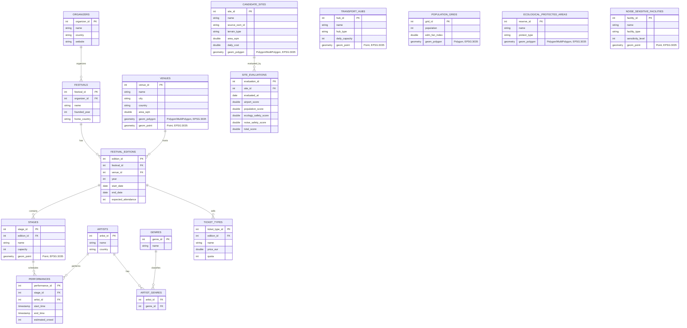

# 基于 PostGIS 的比荷地区大型电子音乐节运营与空间选址数据库设计

本数据库项目面向**比利时与荷兰地区大型电子音乐节的运营管理、场地选址与环境影响评估**。研究对象包括 Tomorrowland、Defqon.1、Awakenings 等欧洲知名电子音乐节。项目不只是把地图图层存进数据库，而是把音乐节品牌、主办方、年度届次、场地、舞台、艺人、演出安排、门票和空间环境评估放进同一个 PostgreSQL + PostGIS 数据库中。

项目核心亮点是：先基于公开空间数据建立一套候选场地评估模型，再将高分候选地与真实音乐节举办地进行空间匹配。如果模型筛出的候选地接近 Tomorrowland 或 Defqon.1 等现实场地，就能形成“关系型业务数据库 + 空间分析 + 现实案例验证”的完整闭环。

---

## 1. 设计理念与研究范围

### 1.1 设计理念

大型电子音乐节同时具有**运营管理属性**和**空间规划属性**：

* 运营层面：主办方需要管理音乐节品牌、年度届次、场地、舞台、艺人、演出安排、门票类型和观众规模。
* 空间层面：大型户外音乐节需要平衡场地面积、交通可达性、生态保护、噪声影响和潜在受众覆盖。

因此，本项目把数据库分成两层：

* **业务关系层**：描述音乐节运营中真实存在的实体关系，类似北风数据库中客户、订单、产品之间的关系。
* **空间分析层**：描述候选场地、交通枢纽、人口网格、保护区和噪声敏感点，用 PostGIS 完成空间筛选和评估。

### 1.2 研究区域

研究区域限定为**比利时 + 荷兰**。该区域电子音乐节密集，公开数据较多，数据规模适中。

代表性现实案例：

* **Tomorrowland**：比利时 Boom，De Schorre 附近。
* **Defqon.1**：荷兰 Biddinghuizen，Walibi Holland 周边。
* **Awakenings**：荷兰多个场地举办，可作为补充验证样本。

---

## 2. 数据来源与可获取性

本项目优先使用公开数据。真实数据难以获得的字段会明确标注为模拟指标，避免将主观假设包装成真实统计数据。

| 数据类别 | 推荐来源 | 数据用途 | 可获取性 |
| :--- | :--- | :--- | :--- |
| 道路、铁路、机场、学校、医院、公园、露营地、活动场地 | OpenStreetMap / Geofabrik | 构造交通枢纽、候选场地、噪声敏感点 | 高 |
| 生态保护区 | EEA Natura 2000 | 判断候选地是否与保护区冲突 | 高 |
| 人口分布 | Eurostat / GISCO population grid | 估算场地周边人口覆盖与噪声影响人口 | 高 |
| 机场信息 | OurAirports 或 OSM | 计算候选地到机场的距离 | 高 |
| 真实音乐节、艺人、届次、场地 | 官方网站、Wikipedia、手工整理 | 构造业务关系层与真实案例验证 | 中 |
| 门票价格、场地租金、综合偏好分 | 人工模拟 | 用于运营查询和评分模型演示 | 中低 |

候选场地可以从 OSM 中筛选以下类型并导入 PostGIS：

* `leisure=park`
* `leisure=recreation_ground`
* `tourism=camp_site`
* `landuse=grass`
* `landuse=recreation_ground`
* `amenity=events_venue`
* 大型停车场、展览场地、户外活动区等

---

## 3. 数据库逻辑结构设计

数据库采用 PostgreSQL + PostGIS 实现，空间字段统一使用 EPSG:3035 坐标系，以米和平方米作为距离、面积计算单位。

### 3.1 核心表设计

本数据库包含 16 张主要表：

**业务关系层**

| 表名 | 作用 |
| :--- | :--- |
| `organizers` | 主办方 |
| `festivals` | 音乐节品牌，如 Tomorrowland、Defqon.1 |
| `festival_editions` | 某一年某一届音乐节 |
| `venues` | 真实举办场地，带空间边界或中心点 |
| `stages` | 某届音乐节的舞台 |
| `artists` | 艺人 |
| `genres` | 音乐流派 |
| `artist_genres` | 艺人与流派的多对多关系 |
| `performances` | 艺人在某舞台、某时间段的演出安排 |
| `ticket_types` | 某届音乐节的门票类型 |

**空间分析层**

| 表名 | 作用 |
| :--- | :--- |
| `candidate_sites` | 候选场地 |
| `site_evaluations` | 候选场地综合评分 |
| `transport_hubs` | 机场、火车站等交通枢纽 |
| `population_grids` | 人口网格 |
| `ecological_protected_areas` | 生态保护区 |
| `noise_sensitive_facilities` | 医院、学校等噪声敏感点 |

### 3.2 ER 图



### 3.3 关系设计说明

这个设计中，音乐节运营部分形成了清楚的主外键链条：

```text
organizers -> festivals -> festival_editions -> stages -> performances
                                          -> ticket_types
venues     -> festival_editions
artists    -> performances
artists    -> artist_genres -> genres
```

空间分析部分则以 `candidate_sites` 为核心，通过 PostGIS 空间关系与交通枢纽、人口网格、保护区和敏感点发生联系。空间关系不是传统外键，而是通过 `ST_DWithin`、`ST_Intersects`、`ST_Contains` 等函数动态计算。

---

## 4. 范式检查与约束设计

### 4.1 范式检查

* **1NF**：所有字段保持原子性。例如艺人的多个流派不存储在 `artists` 的一个字符串字段中，而是通过 `artist_genres` 中间表表达。
* **2NF**：各表主键确定整行数据。`artist_genres` 使用 `(artist_id, genre_id)` 复合主键，且不存在依赖其中某一个字段的非主属性。
* **3NF**：非主键字段不依赖其他非主键字段。例如主办方国家存储在 `organizers` 中，不重复写入每一届音乐节；艺人流派存储在 `genres` 与 `artist_genres` 中，不重复塞进 `performances`。

`site_evaluations.total_score` 可由多个评分项计算得到，严格来说存在可推导冗余。本项目将其作为实验结果缓存字段保存，并在报告中说明也可以用视图动态计算。

### 4.2 主键、外键与检查约束

示例约束：

```sql
CREATE EXTENSION IF NOT EXISTS postgis;

ALTER TABLE festivals
ADD CONSTRAINT fk_festivals_organizer
FOREIGN KEY (organizer_id) REFERENCES organizers(organizer_id);

ALTER TABLE festival_editions
ADD CONSTRAINT fk_editions_festival
FOREIGN KEY (festival_id) REFERENCES festivals(festival_id);

ALTER TABLE festival_editions
ADD CONSTRAINT fk_editions_venue
FOREIGN KEY (venue_id) REFERENCES venues(venue_id);

ALTER TABLE performances
ADD CONSTRAINT chk_performance_time
CHECK (end_time > start_time);

ALTER TABLE ticket_types
ADD CONSTRAINT chk_ticket_price_quota
CHECK (price_eur >= 0 AND quota > 0);

ALTER TABLE candidate_sites
ADD CONSTRAINT chk_site_area
CHECK (area_sqm >= 50000);

ALTER TABLE candidate_sites
ADD CONSTRAINT chk_site_geom_valid
CHECK (ST_IsValid(geom_polygon) AND ST_SRID(geom_polygon) = 3035);

ALTER TABLE population_grids
ADD CONSTRAINT chk_population_nonnegative
CHECK (population >= 0);

ALTER TABLE population_grids
ADD CONSTRAINT chk_edm_fan_index
CHECK (edm_fan_index BETWEEN 0 AND 1);

ALTER TABLE noise_sensitive_facilities
ADD CONSTRAINT chk_sensitivity_level
CHECK (sensitivity_level BETWEEN 1 AND 5);

ALTER TABLE site_evaluations
ADD CONSTRAINT fk_site_evaluation_site
FOREIGN KEY (site_id) REFERENCES candidate_sites(site_id);
```

可选枚举约束：

```sql
ALTER TABLE transport_hubs
ADD CONSTRAINT chk_hub_type
CHECK (hub_type IN ('airport', 'train_station', 'metro_station', 'bus_terminal'));

ALTER TABLE noise_sensitive_facilities
ADD CONSTRAINT chk_facility_type
CHECK (facility_type IN ('hospital', 'school', 'residential', 'elderly_care'));
```

### 4.3 空间索引

所有空间字段建立 GiST 索引：

```sql
CREATE INDEX idx_venues_geom_polygon
ON venues USING gist (geom_polygon);

CREATE INDEX idx_venues_geom_point
ON venues USING gist (geom_point);

CREATE INDEX idx_stages_geom_point
ON stages USING gist (geom_point);

CREATE INDEX idx_candidate_sites_geom
ON candidate_sites USING gist (geom_polygon);

CREATE INDEX idx_transport_hubs_geom
ON transport_hubs USING gist (geom_point);

CREATE INDEX idx_population_grids_geom
ON population_grids USING gist (geom_polygon);

CREATE INDEX idx_protected_areas_geom
ON ecological_protected_areas USING gist (geom_polygon);

CREATE INDEX idx_noise_sensitive_geom
ON noise_sensitive_facilities USING gist (geom_point);
```

---

## 5. 核心 SQL 查询设计

本项目查询分为两类：普通关系查询和 PostGIS 空间查询。这样既能体现数据库课程中的关系建模能力，也能体现空间数据库特色。

### SQL 1：查询某届音乐节的完整演出时间表

```sql
SELECT
    f.name AS festival_name,
    e.year,
    v.name AS venue_name,
    s.name AS stage_name,
    a.name AS artist_name,
    p.start_time,
    p.end_time,
    p.estimated_crowd
FROM festival_editions e
JOIN festivals f ON e.festival_id = f.festival_id
JOIN venues v ON e.venue_id = v.venue_id
JOIN stages s ON e.edition_id = s.edition_id
JOIN performances p ON s.stage_id = p.stage_id
JOIN artists a ON p.artist_id = a.artist_id
WHERE f.name = 'Tomorrowland'
  AND e.year = 2025
ORDER BY p.start_time, s.name;
```

### SQL 2：统计不同流派艺人在各音乐节中的演出数量

```sql
SELECT
    f.name AS festival_name,
    e.year,
    g.name AS genre_name,
    COUNT(*) AS performance_count
FROM festival_editions e
JOIN festivals f ON e.festival_id = f.festival_id
JOIN stages s ON e.edition_id = s.edition_id
JOIN performances p ON s.stage_id = p.stage_id
JOIN artist_genres ag ON p.artist_id = ag.artist_id
JOIN genres g ON ag.genre_id = g.genre_id
GROUP BY f.name, e.year, g.name
ORDER BY f.name, e.year, performance_count DESC;
```

### SQL 3：多准则候选地筛选

筛选满足面积、机场可达性、生态保护区避让、噪声敏感点避让条件的候选场地。

```sql
SELECT s.site_id, s.name, s.area_sqm
FROM candidate_sites s
WHERE s.area_sqm >= 100000
  AND EXISTS (
      SELECT 1
      FROM transport_hubs h
      WHERE h.hub_type = 'airport'
        AND ST_DWithin(s.geom_polygon, h.geom_point, 80000)
  )
  AND NOT EXISTS (
      SELECT 1
      FROM ecological_protected_areas e
      WHERE ST_Intersects(s.geom_polygon, e.geom_polygon)
  )
  AND NOT EXISTS (
      SELECT 1
      FROM noise_sensitive_facilities n
      WHERE n.sensitivity_level >= 4
        AND ST_DWithin(s.geom_polygon, n.geom_point, 3000)
  );
```

### SQL 4：噪声缓冲区影响人口估算

以候选场地 5 公里缓冲区为近似强噪声影响范围，按人口网格相交面积估算受影响人口。

```sql
WITH site_buffer AS (
    SELECT
        site_id,
        name,
        ST_Buffer(geom_polygon, 5000) AS geom_buffer
    FROM candidate_sites
    WHERE site_id = :target_site_id
),
intersected_population AS (
    SELECT
        sb.site_id,
        sb.name AS site_name,
        g.grid_id,
        g.population *
        (
            ST_Area(ST_Intersection(sb.geom_buffer, g.geom_polygon))
            / NULLIF(ST_Area(g.geom_polygon), 0)
        ) AS affected_population
    FROM site_buffer sb
    JOIN population_grids g
      ON ST_Intersects(sb.geom_buffer, g.geom_polygon)
)
SELECT
    site_id,
    site_name,
    ROUND(SUM(affected_population))::int AS total_affected_population
FROM intersected_population
GROUP BY site_id, site_name;
```

### SQL 5：真实音乐节场地匹配验证

筛选完成后，将高分候选地与真实音乐节场地做空间匹配，检验模型结果是否接近现实选址。注意：真实场地只用于验证，不参与候选地评分。

```sql
WITH ranked_sites AS (
    SELECT
        s.site_id,
        s.name,
        ev.total_score,
        s.geom_polygon
    FROM candidate_sites s
    JOIN site_evaluations ev
      ON s.site_id = ev.site_id
    ORDER BY ev.total_score DESC
    LIMIT 20
)
SELECT
    r.site_id,
    r.name AS candidate_site,
    v.name AS real_venue,
    f.name AS festival_name,
    e.year,
    ROUND(ST_Distance(r.geom_polygon, v.geom_point)) AS distance_to_real_venue_m
FROM ranked_sites r
JOIN venues v
  ON ST_DWithin(r.geom_polygon, v.geom_point, 10000)
JOIN festival_editions e
  ON v.venue_id = e.venue_id
JOIN festivals f
  ON e.festival_id = f.festival_id
ORDER BY distance_to_real_venue_m ASC;
```

### SQL 6：场地运营规模与空间风险联合查询

查询每个真实场地承办过的音乐节规模，并计算其 5 公里范围内的高敏感设施数量。

```sql
SELECT
    v.venue_id,
    v.name AS venue_name,
    COUNT(DISTINCT e.edition_id) AS edition_count,
    MAX(e.expected_attendance) AS max_expected_attendance,
    COUNT(DISTINCT n.facility_id) AS sensitive_facility_count_5km
FROM venues v
JOIN festival_editions e
  ON v.venue_id = e.venue_id
LEFT JOIN noise_sensitive_facilities n
  ON n.sensitivity_level >= 4
 AND ST_DWithin(v.geom_point, n.geom_point, 5000)
GROUP BY v.venue_id, v.name
ORDER BY max_expected_attendance DESC;
```

---

## 6. 综合评分思路

可以为每个候选场地计算一个总评分，用于排序：

```text
total_score =
    0.30 * airport_score
  + 0.25 * population_score
  + 0.25 * noise_safety_score
  + 0.20 * ecology_safety_score
```

评分解释：

* `airport_score`：距离机场越近，分数越高，但过近可能产生用地冲突。
* `population_score`：一定范围内人口越多，潜在市场越大。
* `noise_safety_score`：距离医院、学校、密集居民区越远，分数越高。
* `ecology_safety_score`：与生态保护区距离越远、重叠面积越小，分数越高。

评分字段可以通过 SQL 查询动态生成，也可以写入 `site_evaluations` 表作为实验结果。

---

## 7. 可视化与结果展示

可视化不是数据库实现的主体，但可以作为报告展示增强项。推荐使用 QGIS 或 ArcGIS Pro 连接 PostgreSQL/PostGIS 数据库，展示以下图层：

| 图层 | 展示内容 |
| :--- | :--- |
| 真实音乐节场地 | Tomorrowland、Defqon.1 等真实举办场地 |
| 候选场地 | 按总评分分级设色 |
| 交通枢纽 | 机场、火车站点位及服务半径 |
| 噪声缓冲区 | 1km、3km、5km 缓冲区 |
| 生态保护区 | Natura 2000 保护区边界 |
| 人口网格 | 按人口密度或受影响人口分级 |
| 舞台点位 | 某届音乐节的舞台空间分布 |

最终成果可以包括：

* ER 图
* PostgreSQL + PostGIS 建表 SQL
* 数据导入说明
* 主键、外键、检查约束与空间索引设计
* 普通关系查询与空间查询各若干条
* 查询结果截图或表格
* 候选地评分地图
* 模型结果与真实音乐节场地的空间匹配分析

---

## 8. 实施计划

### 第一阶段：业务数据准备

* 整理主办方、音乐节品牌、年度届次、真实场地、舞台、艺人、流派、门票等样例数据。
* 真实数据不足的运营字段可以使用少量模拟数据，但要保持业务逻辑合理。
* 整理 Tomorrowland、Defqon.1、Awakenings 等真实音乐节场地点位。

### 第二阶段：空间数据准备

* 下载比利时、荷兰 OSM 数据。
* 下载 Natura 2000 生态保护区数据。
* 下载 Eurostat/GISCO 人口网格数据。
* 从 OSM 或人工整理中提取候选场地、交通枢纽、敏感设施。

### 第三阶段：PostGIS 数据库建设

* 创建 PostgreSQL 数据库并启用 PostGIS 扩展。
* 建立核心表、主键、外键、检查约束和空间索引。
* 使用 `shp2pgsql`、`ogr2ogr` 或 Python 脚本导入空间数据。
* 统一转换到 EPSG:3035 坐标系。

### 第四阶段：SQL 查询与空间分析

* 执行音乐节运营类关系查询。
* 执行多准则候选地筛选。
* 计算交通可达性、生态冲突、噪声影响人口。
* 生成候选地综合评分。
* 与真实音乐节场地做空间匹配验证。

### 第五阶段：报告与展示

* 绘制 ER 图。
* 编写范式检查、约束设计和 SQL 查询说明。
* 输出地图截图、查询结果表和分析结论。
* 重点展示“模型选出的高分候选地是否接近现实音乐节场地”这一验证结果。

---

## 9. 风险与应对

| 风险 | 应对方式 |
| :--- | :--- |
| 业务数据不如北风数据库完整 | 构造小规模但关系清楚的样例数据，重点展示主外键和多对多关系 |
| OSM 原始数据体量大，提取候选场地和敏感设施繁琐 | 避免直接解析全量比荷 PBF。推荐下载 Geofabrik 预分类的 Shapefile，在 QGIS 中过滤目标要素（如 park, hospital）后再导入数据库；或使用 Overpass Turbo 工具提取特定 POI |
| 不同来源的空间数据坐标系不统一（如 OSM 默认为 EPSG:4326） | 在数据导入阶段使用 `ogr2ogr -t_srs EPSG:3035` 或 QGIS 重投影功能，确保所有空间图层统一转换至 EPSG:3035（欧洲等面积投影）后再存入 PostGIS |
| OSM 中候选场地边界不完整 | 使用多个标签联合筛选，并允许少量手工补充 |
| 真实音乐节实际占地边界难以获得 | `venues` 同时保存场地中心点和可选边界，验证时优先使用中心点 |
| 人口网格数据量较大 | 优先使用 5km 网格，必要时裁剪到比利时 + 荷兰 |
| 租金、粉丝指数缺少权威数据 | 明确作为模拟字段，只用于评分演示 |
| 查询复杂度过高 | 给空间字段建立 GiST 索引，并缩小研究区域 |
