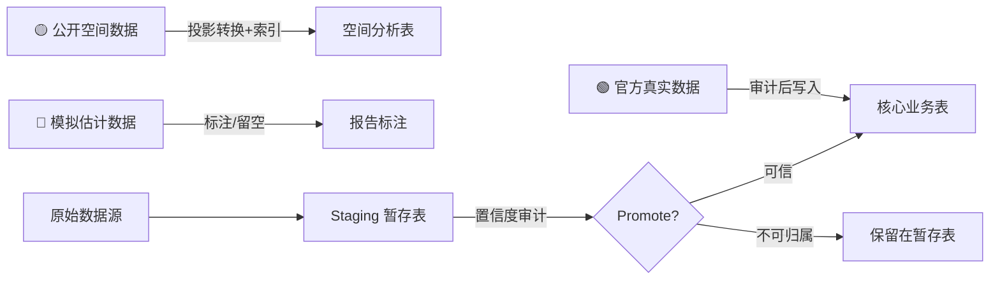

# 数据库期末作业项目架构全面梳理

## 一、项目定位与核心主题

本项目是一个 **基于 PostgreSQL/PostGIS 的比利时与荷兰地区大型电子音乐节运营管理 + 空间选址分析数据库系统**。

项目围绕三个具体音乐节展开：
| 音乐节 | 年份 | 国家 | 举办地 |
|--------|------|------|--------|
| Tomorrowland | 2025 | 🇧🇪 比利时 | De Schorre, Boom |
| Defqon.1 | 2025 | 🇳🇱 荷兰 | Walibi Holland, Biddinghuizen |
| Awakenings Summer Festival | 2025 | 🇳🇱 荷兰 | Beekse Bergen, Hilvarenbeek |

---

## 二、项目目录架构

```mermaid
graph TD
    ROOT["📁 数据库期末作业/"] --> SQL["📁 sql/ (19个SQL脚本)"]
    ROOT --> SCRIPTS["📁 scripts/ (16个脚本)"]
    ROOT --> DATA["📁 data/"]
    ROOT --> DOCS["📁 docs/ (16个文档)"]
    ROOT --> FIGS["📁 figs/ (4个评分地图)"]
    ROOT --> EXPORTS["📁 exports/ (19个导出成果)"]
    ROOT --> QGIS["📁 qgis-project/"]
    ROOT --> TEX["📄 final_database_project_report.tex"]
    ROOT --> BIB["📄 references.bib"]

    DATA --> RAW["📁 raw/ 原始抓取数据"]
    DATA --> PROCESSED["📁 processed/ 处理后数据"]
    DATA --> QUERIES["📁 queries/"]
    DATA --> SOURCES["📁 sources/"]

    SQL --> S01["01_schema.sql 建表DDL"]
    SQL --> S02["02_seed_data.sql 种子数据"]
    SQL --> S03["03_analysis_queries.sql 分析查询"]
    SQL --> S05["05_views.sql 报表视图"]
    SQL --> S06["06-08 公开数据规范化"]
    SQL --> S09["09 重算评分"]
    SQL --> S10["10-18 业务数据导入与提升"]
    SQL --> S19["19 噪声缓冲区视图"]
```



---

## 三、数据库表结构设计 (18 张表)

### 业务关系层 (12 张表)

整个业务层形成一条清晰的主链路：

```
organizers → festivals → festival_editions → stages → performances → performance_artists → artists
                              ↓                                                               ↓
                           venues                                                        artist_genres → genres
                              ↓
                     ticket_types → ticket_price_offers
```

| 表名 | 中文名 | 核心字段 | 说明 |
|------|--------|---------|------|
| `organizers` | 主办方 | organizer_id, name, country | 音乐节运营公司 |
| `festivals` | 音乐节品牌 | festival_id, organizer_id(FK), name, founded_year | 品牌级实体 |
| `venues` | 真实场地 | venue_id, geom_polygon, geom_point(EPSG:3035) | 含空间几何 |
| `festival_editions` | 年度届次 | edition_id, festival_id(FK), venue_id(FK), year | 每年一届 |
| `stages` | 舞台 | stage_id, edition_id(FK), capacity, geom_point | 舞台空间点位 |
| `performances` | 演出节目块 | performance_id, stage_id(FK), start_time, end_time | 时间段表达 |
| `performance_artists` | 演出-艺人关联 | performance_id(PK,FK), artist_id(PK,FK), artist_order, role | **多对多关联表** |
| `artists` | 艺人 | artist_id, name, country | |
| `genres` | 音乐流派 | genre_id, name | |
| `artist_genres` | 艺人-流派关联 | artist_id(PK,FK), genre_id(PK,FK) | **多对多关联表** |
| `ticket_types` | 票种 | ticket_type_id, edition_id(FK), price_eur, quota, is_simulated | |
| `ticket_price_offers` | 票价报价 | offer_id, ticket_type_id(FK), sale_category, confidence | **多阶段定价** |

### 空间分析层 (6 张表)

| 表名 | 中文名 | 几何类型 | 数据来源 |
|------|--------|---------|---------|
| `candidate_sites` | 候选场地 | MultiPolygon(3035) | OSM |
| `site_evaluations` | 选址评分 | - (FK→candidate_sites) | PostGIS 计算 |
| `transport_hubs` | 交通枢纽 | Point(3035) | OurAirports + OSM |
| `population_grids` | 人口网格 | Polygon(3035) | Eurostat Census Grid 2021 |
| `ecological_protected_areas` | 生态保护区 | MultiPolygon(3035) | EEA Natura 2000 |
| `noise_sensitive_facilities` | 噪声敏感设施 | Point(3035) | OSM |

> [!IMPORTANT]
> 空间分析层的表之间**不设物理外键**，通过 PostGIS 空间函数 (`ST_Distance`, `ST_Intersects`, `ST_DWithin`, `ST_Buffer`, `ST_Intersection`) 在查询时动态计算关联关系。

---

## 四、数据来源分层体系

项目建立了严格的**三级数据真实性分层**：



具体数据来源：
- **Tomorrowland**: Wayback Machine CDN JSON → 完整的舞台/艺人/演出时刻表 + 多阶段票价
- **Awakenings**: 官方 Shop API 深层抓包 → 活动基本事实 + 住宿套餐价格
- **Defqon.1**: 官方历史页面快照 → 日期与购票入口（票价不可得，留空处理）
- **空间数据**: OSM Overpass API、Eurostat 1km人口网格、EEA Natura 2000、OurAirports

---

## 五、SQL 脚本执行链路 (19 个脚本)

| 序号 | 文件 | 功能 |
|------|------|------|
| 01 | [01_schema.sql](file:///c:/Users/12907/Desktop/2025-2026大三下学期/数据库原理及应用/数据库期末作业/sql/01_schema.sql) | 建表DDL + 约束 + GiST空间索引 |
| 02 | [02_seed_data.sql](file:///c:/Users/12907/Desktop/2025-2026大三下学期/数据库原理及应用/数据库期末作业/sql/02_seed_data.sql) | 初始种子数据 |
| 03 | [03_analysis_queries.sql](file:///c:/Users/12907/Desktop/2025-2026大三下学期/数据库原理及应用/数据库期末作业/sql/03_analysis_queries.sql) | 7个可复用分析查询 |
| 04 | 04_import_templates.sql | 数据导入模板 |
| 05 | [05_views.sql](file:///c:/Users/12907/Desktop/2025-2026大三下学期/数据库原理及应用/数据库期末作业/sql/05_views.sql) | 8个报表视图 |
| 06-08 | 06/07/08_normalize_*.sql | 公开空间数据规范化(Natura 2000/人口网格/机场) |
| 09 | 09_recalculate_site_scores.sql | 重算候选地评分 |
| 10 | 10_business_scrape_staging.sql | 业务抓取暂存 |
| 11-12 | 11/12_import/promote_tomorrowland_lineup.sql | Tomorrowland 2025 lineup 导入+提升 |
| 13 | 13_add_performance_artists_model.sql | performance_artists 多对多模型 |
| 14 | 14_update_real_venue_boundaries.sql | 真实场地边界修正 |
| 15-16 | 15/16_import/promote_ticket_prices.sql | Tomorrowland 票价导入+提升 |
| 17 | 17_remove_replaced_demo_samples.sql | 清理历史演示样本 |
| 18 | 18_import_defqon_awakenings_capture.sql | Defqon/Awakenings 数据导入 |
| 19 | 19_noise_buffer_map_views.sql | 噪声缓冲区地图视图 |

---

## 六、核心分析查询与视图 (7个查询 + 8个视图)

### 7 个分析查询

| 编号 | 查询名称 | 涉及技术 |
|------|---------|---------|
| Q1 | Tomorrowland 2025 完整演出时刻表 | 6表 JOIN |
| Q2 | 按流派统计演出场次 | 7表 JOIN + GROUP BY |
| Q3 | **多准则空间筛选** | EXISTS/NOT EXISTS + `ST_DWithin` + `ST_Intersects` |
| Q4 | **5km噪声缓冲区受影响人口** | CTE + `ST_Buffer` + `ST_Intersection` + `ST_Area` 面积比例 |
| Q5 | **高分候选地与真实场地匹配** | CTE + `ST_DWithin` + `ST_Distance` |
| Q6 | 场地运营规模与敏感点统计 | LEFT JOIN + `ST_DWithin` |
| Q7 | **动态重算选址评分** | 完整评分公式实现 |

### 8 个报表视图

| 视图名 | 用途 |
|--------|------|
| `v_tomorrowland_2025_timetable` | Tomorrowland 完整时刻表 |
| `v_performance_count_by_genre` | 流派演出统计 |
| `v_multicriteria_candidate_sites` | 多准则筛选候选地 |
| `v_affected_population_5km` | 5km噪声影响人口 |
| `v_real_venue_match_validation` | 真实场地匹配验证 |
| `v_venue_scale_risk_summary` | 场地规模风险概览 |
| `v_dynamic_site_scores` | 动态评分(含LATERAL JOIN) |
| `v_site_score_explanation` | 评分详解(全量指标+排名) |

---

## 七、选址评分模型 (四维加权评分)

```
总评分 = 0.30 × S_airport + 0.25 × S_population + 0.25 × S_noise + 0.20 × S_ecology
```

| 维度 | 权重 | 计算公式 | 数据来源 |
|------|------|---------|---------|
| 交通可达性 | 30% | `max(0, min(100, 100 - d_airport/1000))` | transport_hubs (airport) |
| 市场人口覆盖 | 25% | `Σ(P_i × I_i) / P_max × 100` | population_grids (25km范围) |
| 噪声防范安全 | 25% | `max(0, min(100, d_noise/100))` | noise_sensitive_facilities (≥4级) |
| 生态安全 | 20% | `max(0, min(100, d_ecology/1000))` | ecological_protected_areas |

---

## 八、作业要求对照与预期实现结果

根据 [report_instructions.md](file:///c:/Users/12907/Desktop/2025-2026大三下学期/数据库原理及应用/数据库期末作业/report_instructions.md) 中的**作业要求**：

> **设计一个数据库，包括：名称、设计理念、画ER图、范式检查、设计主键及约束、录入数据；设计并实现几道SQL查询。**

| 作业要求项 | 完成情况 | 对应位置 |
|-----------|---------|---------|
| ✅ **数据库名称** | `festival_gis` — Benelux 电子音乐节 GIS 数据库 | README + 报告一 |
| ✅ **设计理念** | 业务关系层 + 空间分析层双层融合架构 | 报告第一节 |
| ✅ **ER 图** | TikZ 绘制的完整 E-R 图，含 18 张表、关系菱形、基数标注 | 报告图1 (第247-503行) |
| ✅ **范式检查** | 明确说明满足 3NF，消除传递/部分依赖 | 报告第三节 |
| ✅ **主键及约束** | 每张表均有 IDENTITY PK、FK、UQ、CHECK 约束 + 空间有效性约束 | 01_schema.sql |
| ✅ **录入数据** | 真实官方数据 + 公开空间数据 + 完整 ETL 流水线 | sql/02-18 + scripts/ |
| ✅ **SQL 查询** | 7 个可复用分析查询 + 8 个视图，涵盖 JOIN/CTE/PostGIS 空间分析 | 03_analysis_queries.sql + 05_views.sql |

---

## 九、项目亮点与超出作业要求的部分

> [!TIP]
> 本项目在完成基础作业要求之外，做了大量超额工作：

1. **PostGIS 空间分析**：不是简单的关系型数据库，而是集成了 GIS 空间函数进行多准则选址分析
2. **真实数据采集**：通过 Wayback Machine、官方 API 抓包等手段获取真实业务数据，而非全部编造
3. **数据治理体系**：Staging → Audit → Promote 三阶段分层治理，维护数据血缘
4. **QGIS 可视化**：配合 QGIS 项目文件生成空间分析地图
5. **模型验证闭环**：评分模型的高分候选地与真实举办场地成功空间匹配
6. **规范化建模优化**：`performance_artists` 解决多艺人合作演出、`ticket_price_offers` 解决多阶段定价

---

## 十、报告当前状态与待完善项

> [!WARNING]
> 以下为报告中仍存在的 **Placeholder（占位符）**，尚未填入实际地图：

| 占位符位置 | 报告行号 | 说明 |
|-----------|---------|------|
| 图5 (fig:qgis_ecology_overlay) | L642-652 | Natura 2000 保护区与候选场地叠加分析图 |
| 图8 (fig:qgis_noise_buffer) | L736-746 | 噪声敏感设施 5km 缓冲区分析图 |
| 图9 (fig:qgis_validation_match) | L776-786 | 高分候选地与真实场地匹配验证图 |
| 图10 (fig:qgis_tomorrowland_stages) | L831-841 | Tomorrowland 2025 舞台空间分布热力图 |
| 图11 (fig:qgis_three_venues_compare) | L877-887 | 三大场地环境要素对比图 |

这些占位符需要从 QGIS 项目导出实际地图后替换。
